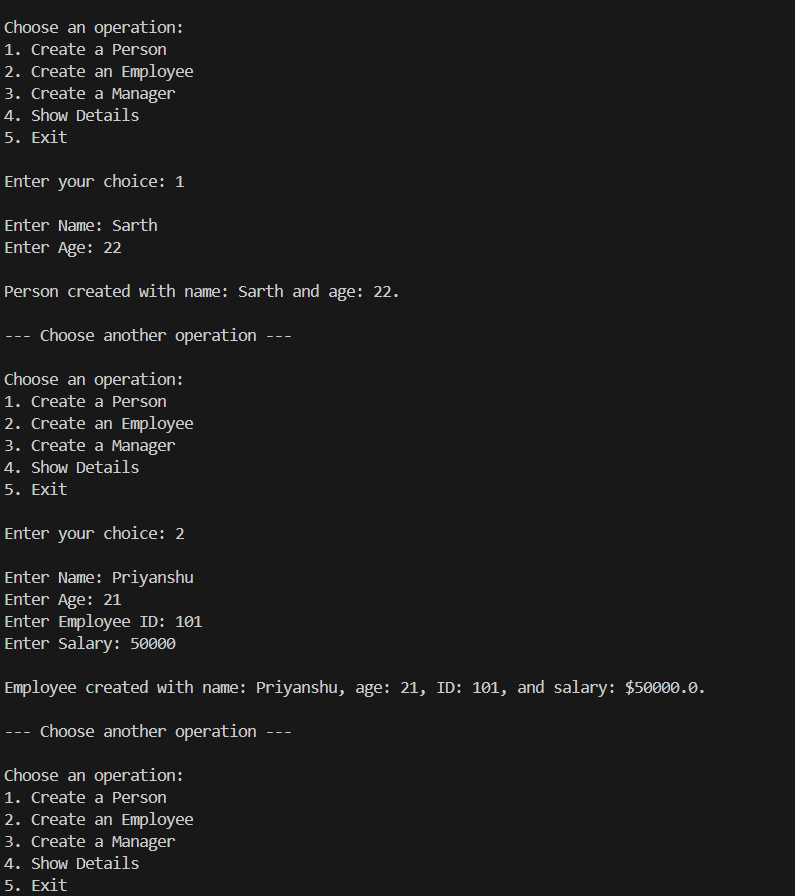
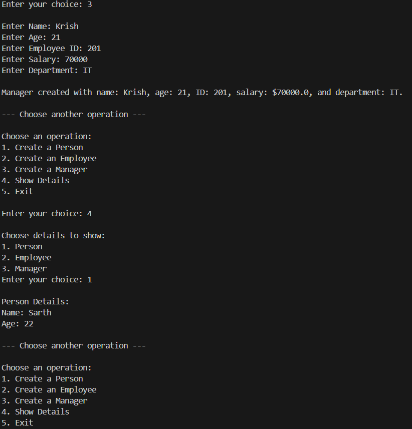
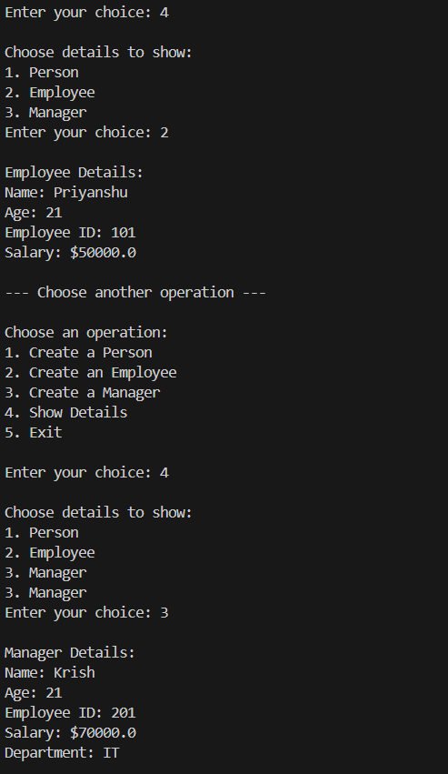
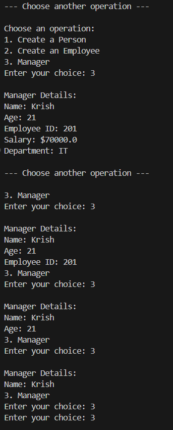
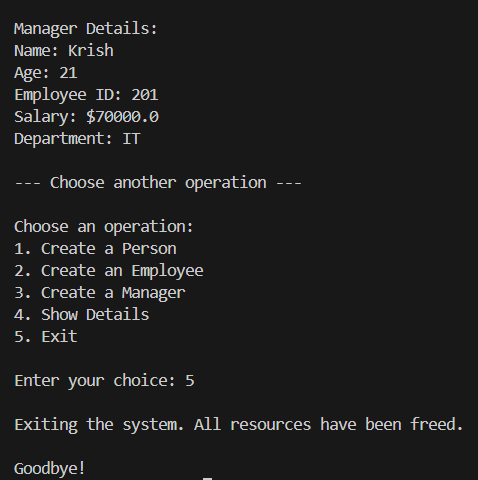

# Oop-Wrapper

## Project Overview

The **Oop Wrapper** is a Python-based console application developed using Object-Oriented Programming (OOP) concepts. The program allows users to create and manage different types of employee records, including Employees and Managers, through a menu-driven interface.

This project demonstrates the implementation of classes, inheritance, encapsulation, constructors, method overriding, and polymorphism in Python.

---

## Features

### 1. Create a Person

* Accepts basic details:

  * Name
  * Age
* Stores the information as a basic person record.

### 2. Create an Employee

* Accepts:

  * Name
  * Age
  * Employee ID
  * Salary
* Stores employee details securely using encapsulation.

### 3. Create a Manager

* Accepts:

  * Name
  * Age
  * Employee ID
  * Salary
  * Department
* Demonstrates inheritance by extending the Employee class.

### 4. Display Details

Allows users to view:

* Person Details
* Employee Details
* Manager Details

Displays all stored information in a user-friendly format.

### 5. Exit Program

* Safely terminates the application.
* Releases allocated resources.

---

## Concepts Demonstrated

### Classes and Objects

The project uses the following classes:

* `Employee`
* `Manager`
* `Developer`

Objects are created dynamically based on user input.

### Constructor

Used to initialize object attributes:

```python
def __init__(self, name=None, age=None, employee_id=None, salary=None):
```

### Inheritance

The `Manager` and `Developer` classes inherit properties and methods from the `Employee` class.

```python
class Manager(Employee):
```

```python
class Developer(Employee):
```

### Encapsulation

Private attributes are implemented using double underscores:

```python
self.__employee_id
self.__salary
```

Access is controlled through getter and setter methods.

### Getter and Setter Methods

Used to access and modify private data members:

```python
get_employee_id()
set_employee_id()
get_salary()
set_salary()
```

### Method Overriding

The `display()` method is overridden in derived classes.

```python
def display(self):
```

This allows specialized display behavior for Managers and Developers.

### Polymorphism

The same method name (`display`) behaves differently depending on the object type.

### Destructor

A destructor is included for object cleanup.

```python
def __del__(self):
```

---

## Program Flow

1. Program starts and displays the main menu.
2. User selects an operation.
3. User enters the required details.
4. Objects are created and stored.
5. User can view stored records.
6. Program continues until the user chooses Exit.
7. All resources are released before termination.

---

## Menu Options

```text
1. Create a Person
2. Create an Employee
3. Create a Manager
4. Show Details
5. Exit
```

---

## Class Structure

### Employee Class

Attributes:

* Name
* Age
* Employee ID (Private)
* Salary (Private)

Methods:

* get_employee_id()
* set_employee_id()
* get_salary()
* set_salary()
* display()

### Manager Class

Additional Attribute:

* Department

Additional Functionality:

* Displays department information along with employee details.

### Developer Class

Additional Attribute:

* Programming Language

Additional Functionality:

* Displays programming language information along with employee details.

---

## Output Screenshots

### Output 1



### Output 2



### Output 3



### Output 4



### Output 5



---

## 🎥 Project Demo Video

Watch the complete project demonstration here:

[▶ Watch Demo Video](YOUR_VIDEO_LINK_HERE)

---

## Author

**Sarth Thakar**
